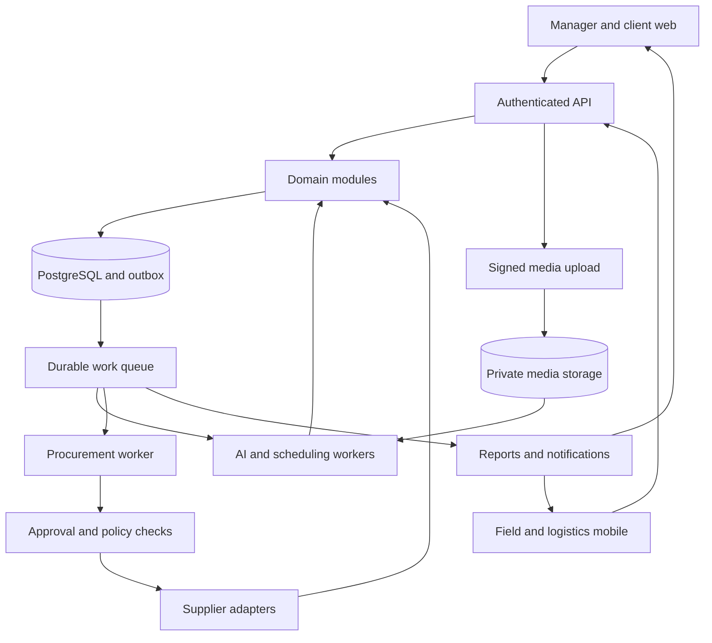
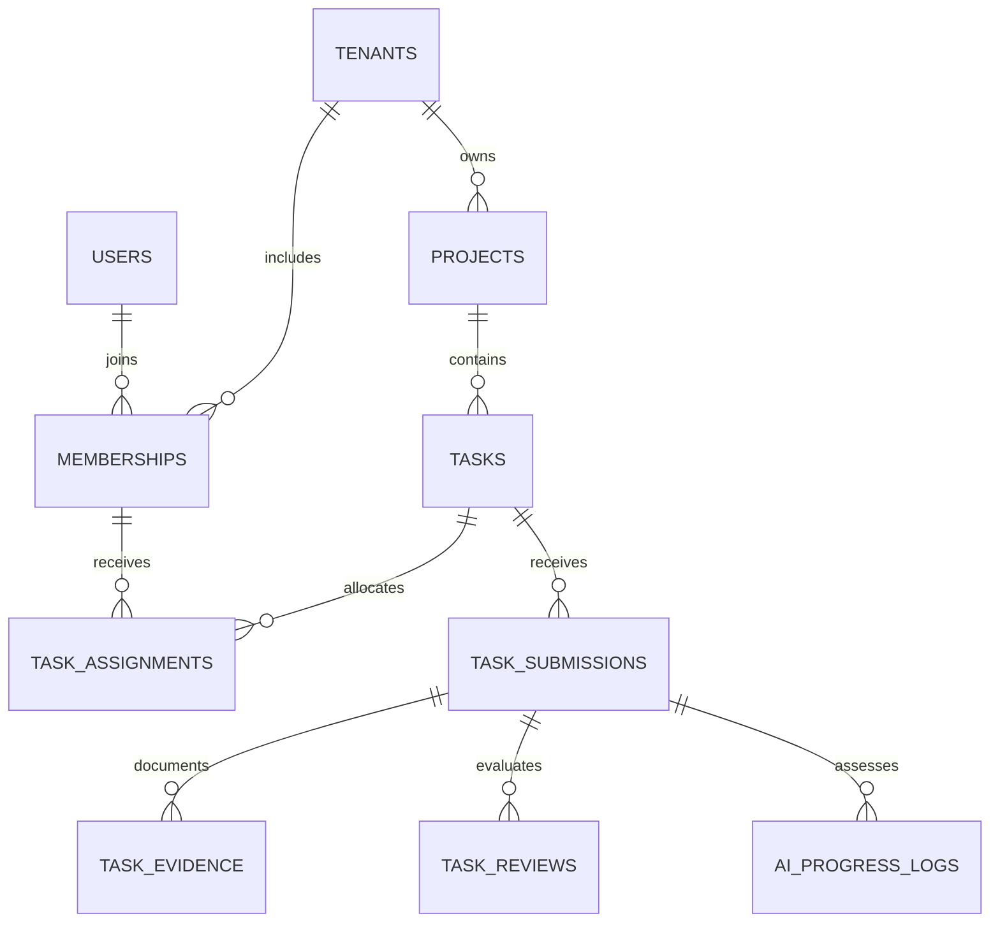
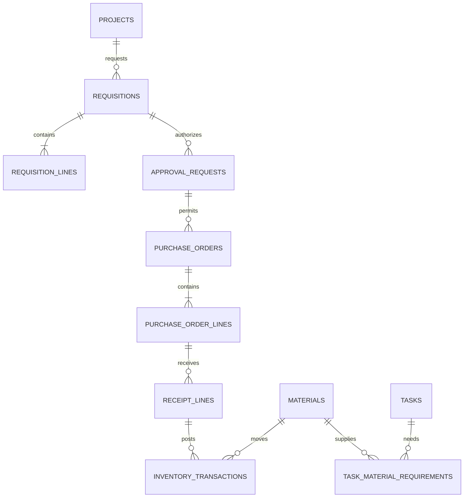
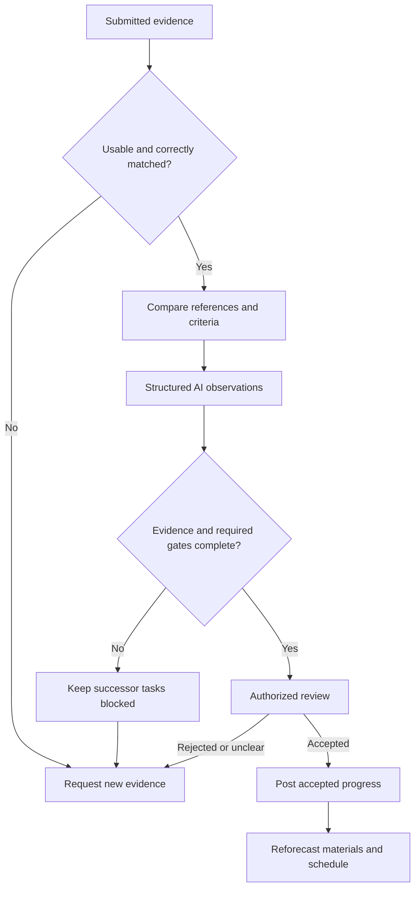
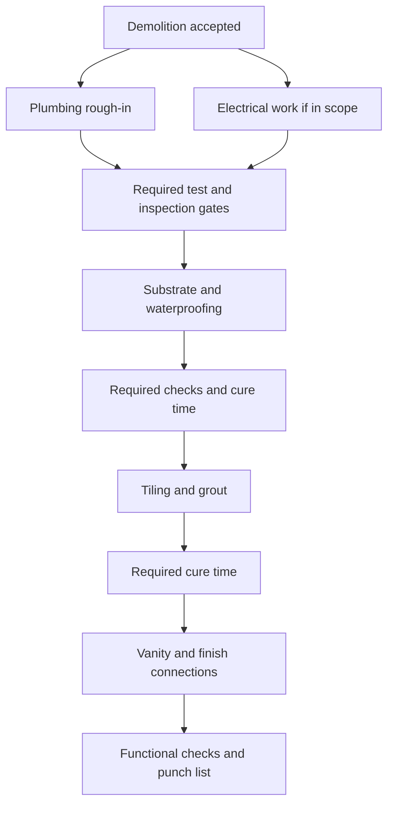
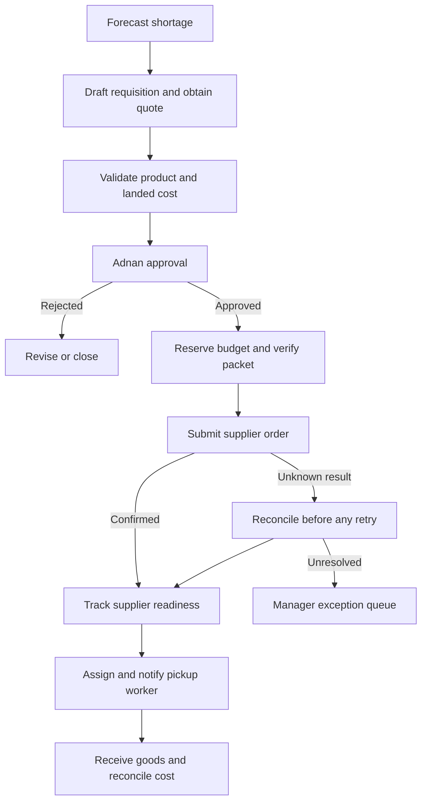

# ursai.net — Technical Blueprint and Implementation Roadmap

Prepared for Adnan • 19 September 2026 • Architecture specification v1.0

## Executive decision

Build ursai.net as a multi-tenant construction operations platform with a responsive manager dashboard and one mobile application that adapts to field-worker, manager, and logistics roles. Begin with a modular backend, PostgreSQL, private media storage, and durable background jobs. Add AI as an evidence and planning service; use deterministic application services to authorize changes, post financial transactions, and execute approved purchases.

The first product must reliably answer: Who is working where? What was completed and accepted? What is blocked? What materials will be needed? What has been spent or committed? What must Adnan decide today?

Three constraints govern the design:

1. A finished rendering expresses design intent. It cannot prove that concealed plumbing, electrical work, waterproofing, or required tests are complete. Accepted work requires task-specific evidence and appropriate human verification.
2. Material availability comes from inventory transactions, receipts, counts, and confirmed orders. Photos supplement these records; they do not provide an authoritative stock ledger.
3. A supplier catalog, supplier ordering connection, and payment rail are separate capabilities. Automated purchasing is enabled only for an integration whose permissions and order lifecycle have been verified.

Planning assumptions: start with one company, Adnan, three active renovation projects, and approximately 10–30 workers; design tenant boundaries for future companies. Initial currency is USD; each project has an IANA timezone. These are sizing assumptions, not facts supplied by the user. Domain ownership, DNS configuration, supplier contracts, payroll policies, and deployment accounts remain implementation inputs. This document specifies the system; it does not claim a deployed application or tested SQL migrations.

## 1. System architecture and technology choices

### 1.1 Recommended stack

| Layer | Recommendation | Purpose and tradeoff |
|---|---|---|
| Manager and client web | Next.js, React, TypeScript | Responsive dashboard, schedules, budget tables, evidence review, and restricted client portal. |
| Field and logistics mobile | React Native with Expo and TypeScript | One iOS/Android application with role-specific navigation; shared types and API client with web. Native screens remain tailored to mobile. |
| Local mobile data | SQLite, encrypted build configuration, secure OS credential storage | Assigned tasks, queued changes, and evidence metadata survive interrupted connectivity. Local media stays in protected app storage until synchronized. |
| API | NestJS on a supported Node.js LTS release; REST and OpenAPI | Modular domain services, request validation, tenant authorization, state transitions, and documented contracts. |
| Database | Managed PostgreSQL | Transactions and relational constraints for assignments, approvals, stock, purchasing, and job costing; JSONB for versioned AI payloads. |
| Media | Private S3-compatible object storage | Direct signed uploads, thumbnails, document versions, video derivatives, retention policies. Store references in PostgreSQL. |
| Background work | PostgreSQL transactional outbox plus managed queue and dead-letter queue | Reliable photo processing, notifications, report generation, and supplier reconciliation. PostgreSQL persists workflow state. |
| AI workers | Python service with typed request/response contracts | Image processing, multimodal model calls, forecast calculations, and scheduling optimization. No direct purchasing authority. |
| Schedule engine | Dependency graph first; OR-Tools CP-SAT when resource scheduling is introduced | Applies trade, crew, location, material, calendar, and dependency constraints. |
| Identity | Managed OIDC identity provider with MFA for privileged roles | Authentication separate from application-owned tenant, role, and project authorization. |
| Notifications | Expo Push initially; APNs/FCM delivery; durable in-app inbox | Push is an alert, not proof of delivery or a transactional record. |
| Hosting | Managed containers, managed PostgreSQL, object storage, queue, secret manager, CDN/WAF | A practical AWS reference deployment is ECS/Fargate, RDS, S3, SQS, Secrets Manager, and CloudFront. Equivalent managed infrastructure is acceptable. |
| Operations | OpenTelemetry traces, centralized logs, error tracking, infrastructure as code, CI/CD | Reproducible environments, operational visibility, auditable releases, and tested recovery. |

Choose supported, mutually compatible versions at kickoff, pin them, and schedule upgrades. This document intentionally does not promise a particular latest model or framework release.

**Why React Native:** it lets one TypeScript team cover web and mobile while supporting camera and mobile workflows. Flutter is a reasonable alternative for an experienced Dart team. A responsive web/PWA pilot is useful for managers but should not be the only field capture strategy where interrupted uploads and mobile OS background restrictions matter. Expo supplies persistent SQLite and a unified push integration; application-level conflict handling and delivery acknowledgment still need to be built. [Expo SQLite](https://docs.expo.dev/versions/latest/sdk/sqlite/), [Expo push notifications](https://docs.expo.dev/push-notifications/overview/).

**Why PostgreSQL:** the core problem is relational and transactional. MongoDB adds little value here as a second primary database. Firebase can supply selected infrastructure such as FCM, but using Firestore alongside PostgreSQL as a second authoritative ledger creates avoidable reconciliation work. Add pgvector only when measured retrieval needs justify it; simple project, room, and task filters should come first.

### 1.2 Runtime topology



Start with domain modules in a modular monolith: identity/access, projects, workforce, tasks, evidence, inventory, procurement, logistics, job costing, and reporting. Deploy API and asynchronous workers separately; maintain one transactional database initially. Extract a module into an independent service only when scaling, availability, or ownership creates a measurable need.

No client receives database administrator credentials. AI workers submit structured observations through internal contracts. Only domain services update accepted progress, stock balances, budget reservations, and order state.

### 1.3 Authorization model

Authorization is: authenticated identity + active company membership + permission + project assignment + resource state. A job specialty is not an authorization role: someone can be both a plumber and a logistics worker.

| Capability | Owner | Project manager | Field worker | Logistics | Client |
|---|---|---|---|---|---|
| Create projects and budgets | Yes | Delegated | No | No | No |
| View projects | All company | Assigned | Assigned tasks/context | Assigned deliveries | Explicitly shared |
| Assign work and publish schedules | Yes | Assigned projects | No | No | No |
| Submit time and evidence | Yes | Yes | Own assignments | Own assignments | No |
| Accept completed work | Yes | Delegated | No by default | Delivery receipt only if authorized | No |
| Request materials | Yes | Yes | Assigned projects | Assigned deliveries | No |
| Approve purchases | Yes | Within delegated limit | No | No | No |
| View labor rates and full costs | Yes | Explicit permission | Own permitted records | No | No |
| Retrieve pickup codes | Yes | Assigned project | No | Assigned order | No |
| View client reports | Yes | Assigned | No by default | No | Published reports only |

Use server authorization plus PostgreSQL row-level security as defense in depth. The runtime DB role must not own tables or have BYPASSRLS; set verified tenant context transaction-locally, especially with pooled connections. Enforce project scope in addition to tenant scope. PostgreSQL documents both policy behavior and privileged-role bypasses. [PostgreSQL row security](https://www.postgresql.org/docs/current/ddl-rowsecurity.html).

### 1.4 Integration boundaries

| Integration | Implementation contract | Launch condition |
|---|---|---|
| Home Depot, Lowe’s, other suppliers | Adapter methods: catalog search, quote, submit order, query status, cancellation, receipt/invoice retrieval; capability flags per supplier account | Obtain official account-specific documentation, commercial eligibility, sandbox/test path, permitted payment method, and order reconciliation rules. Public ordering access for ursai.net is unverified. |
| PunchOut / cXML / EDI | Map cart, purchase order, acknowledgment, and invoice messages separately | Confirm the supplier supports the exact transaction flow; a returned cart alone is not an accepted order. |
| Manual supplier fallback | Approved purchase packet, supplier checkout handoff, uploaded confirmation, recorded external order number | Available in Phase 1; maintain the same requisition and receipt controls. |
| SaaS subscriptions or client collections | Stripe or another gateway through a separate billing module | Only if included in product scope; do not confuse this with supplier purchasing. |
| Supplier payment | Supplier business account/invoice terms or supported tokenized card/issuing arrangement | Confirm merchant acceptance and commercial eligibility. Credentials remain in the vault, outside model prompts. |
| Notifications | Push, in-app inbox; optional transactional email/SMS | Device registration, opt-in preferences, retries, delivery tracking, and user acknowledgment. |
| Navigation | Deep link to installed map application | Driver sees supplier address, hours, pickup window, and site destination. |
| Accounting | Approved job-cost export first; later a verified accounting connector | Stable cost codes and deduplication of imported invoices/expenses. Payroll processing is outside the MVP. |

Stripe Issuing provides card-issuing capabilities; that does not itself provide retailer checkout access. Evaluate it only if the business qualifies and needs controlled purchasing cards. [Stripe Issuing](https://docs.stripe.com/issuing).

### 1.5 APIs, events, and consistency

Version APIs under `/v1`. All mutations carry a client-generated operation ID; sensitive writes also require the expected resource version. Return `409` for conflicting versions, `403` for unauthorized scope, and a typed validation error for prohibited state transitions. Use cursor pagination and generated OpenAPI clients.

| Endpoint | Intent |
|---|---|
| `POST /projects` | Create project, timezone, cost codes, and initial scope. |
| `POST /projects/{id}/baseline-versions` | Register immutable design/reference revision for review. |
| `GET /me/assignments?date=...` | Return only authorized daily assignments and schedule version. |
| `POST /time-entries` | Submit time interval with task/project allocation and operation ID. |
| `POST /media/upload-sessions` | Authorize object path, media size/type, checksum, expiry. |
| `POST /media/{id}/finalize` | Verify stored object and enqueue processing once. |
| `POST /tasks/{id}/submissions` | Submit checklist, quantity, evidence links, and blockers. |
| `POST /submissions/{id}/review` | Accept, reject, or request more evidence. |
| `POST /requisitions` | Draft material request from worker or forecast. |
| `POST /approval-requests/{id}/decisions` | Approve exact version and bounded cost; atomic budget reservation. |
| `POST /schedule-versions/{id}/publish` | Validate constraints and activate one schedule version. |
| `POST /delivery-jobs/{id}/receipts` | Record line-level received quantities, damage, and proof. |
| `POST /sync/batch` and `GET /sync/changes?cursor=...` | Push idempotent offline operations; fetch authorized changes and tombstones. |

Key events: `EvidenceFinalized`, `TaskSubmitted`, `TaskAccepted`, `GatePassed`, `InventoryPosted`, `ShortageForecasted`, `RequisitionApproved`, `OrderConfirmed`, `OrderReadyForPickup`, `DeliveryReceived`, `SchedulePublished`, `ReportPublished`. Persist the business change and outbox event in the same database transaction. Consumers deduplicate by event ID; use bounded retries, dead-letter routing, and operator replay. Delivery is at least once; business effects must be idempotent.

## 2. End-to-end user journeys and wireframe outlines

### 2.1 Manager: onboarding through purchase approval

1. Adnan selects a house, bathroom, or basement template; enters address, client, target dates, budget, timezone, and assigned manager.
2. Define rooms/zones, scope, trades, measurable quantities, cost codes, and work breakdown. Upload as-is photos, approved renderings, blueprints, and specifications. Mark each document with type, revision, room, approval, and intended use.
3. Review AI-suggested tasks and material takeoffs; explicitly approve the baseline, quantities, dependency graph, and gates. A rendering alone must not silently create a reliable bill of materials.
4. Assign qualified workers and availability across all three projects; confirm shared crew capacity. Publish schedule version 1.
5. Review submitted progress with photos, AI observations, test/inspection records, and missing evidence. Accepted progress drives verified project completion.
6. Open a material warning; inspect stock freshness, upcoming demand, outstanding orders, supplier quote, and effect on finish date.
7. Approve the exact purchase packet. Display landed total, tax/freight assumptions, supplier/store, SKU/specification, quantity, project, delivery method, substitutions policy, and approval expiry.
8. Track confirmed order and pickup readiness; resolve shortages and substitutions. Review report preview before client publication.

**Manager web wireframe**

| Screen region | Content |
|---|---|
| Left navigation | Overview, Projects, Workforce, Schedule, Materials, Approvals, Costs, Reports, Settings |
| Top bar | Company selector, project search, sync/data freshness, alerts, profile |
| KPI strip | Active projects, accepted vs planned progress, blocked tasks, forecast cost variance |
| Main panel | Full House / Bathroom / Basement cards with next milestone and top blocker |
| Action panel | Purchase approvals, evidence reviews, schedule changes, overdue acknowledgments |
| Project workspace | Overview / Tasks / Schedule / Evidence / Materials / Budget / Reports tabs |
| Evidence drawer | Baseline and progress images, task criteria, AI observations, missing tests, Accept / Request evidence / Reject |
| Approval drawer | Versioned line items, all-in cost, shortage date, available budget, Approve / Revise / Reject |

Manager mobile starts with an action inbox. One-tap approval is available only after the complete current packet is displayed in an authenticated session. A changed quote requires renewed approval; a push notification never directly authorizes a purchase.

### 2.2 Field worker: check-in through next-day sync

1. Sign in and download assigned work, room references, and current schedule before arriving.
2. Check in to the project; start a task timer. Optional location supports the record but is not the sole proof of attendance. No continuous location collection is required.
3. Open a task card showing location, dependencies, checklist, specification, required evidence, and planned quantity. Blocked tasks explain why work cannot start.
4. Mark check items, enter installed quantity, record material consumption, and report blockers by text or voice.
5. Capture guided overview and detail photographs. Upload videos only when useful; make upload size and mobile-data preferences explicit.
6. Submit for review. Offline submissions remain visibly queued; they do not falsely appear accepted or uploaded.
7. Stop timer/check out; confirm daily hours and outstanding uploads. Receive tomorrow’s published schedule and acknowledge assignment changes.

**Mobile wireframe:** bottom tabs `Today | Capture | Materials | Inbox`; header shows project, local date, and sync state. Today contains large task cards with `Start`, `Blocked`, and `Submit evidence`. Capture shows the required angle, example/reference, capture control, and upload queue. Limit typing; provide readable outdoor contrast, large targets, and optional language preferences.

### 2.3 Logistics: pickup through receiving

1. Receive an assignment when an order is confirmed; distinguish awaiting readiness from ready for pickup.
2. Open order card: store, pickup window, contact, line items, package dimensions/weight if available, pickup authorization, site, and manager contact.
3. Acknowledge and open navigation. Pickup credentials are restricted to the assigned driver and shown only when needed.
4. At the store, record actual collected quantities and exceptions. Substitutions or price increases return to the purchasing approval process.
5. Mark goods in transit. This transfers stock into a transit location; it does not make it usable at the site.
6. At delivery, capture line-level quantities, condition, photo, receiver, and time. Receiver confirms or records discrepancy.
7. Post accepted receipt into site stock and update blocked tasks. Damaged or quarantined goods stay unavailable.

**Mobile wireframe:** `Pickups | Deliveries | Inbox`; each job card shows `Awaiting store → Ready → Collected → Delivered → Received`, with exceptions such as partial, damaged, missing, canceled. Route planning can be added later; the MVP uses navigation deep links.

### 2.4 Offline rules

Persist operations in a local outbox with UUID, device ID, actor, resource ID, base version, capture timestamp, and payload. Upload media resumably; finalize only after checksum verification. Re-check authorization at server receipt, including revoked memberships. Preserve rejected local work for an authorized recovery path rather than silently discarding it.

Append evidence and notes; never use last-write-wins for approval, inventory, accepted completion, or costs. Concurrent task edits become explicit conflicts. Time overlaps require review. Retried operations reuse the same ID. Schedule changes retain a version; an offline worker can see that a cached plan is stale. Background upload is best-effort because mobile OS restrictions apply; resume on foreground/reconnection and keep the queue visible.

## 3. Complete logical database schema and data models

This is the normalized logical schema for the described product boundary, including operational support tables. It is a migration design contract, not executed SQL. Subscription billing, general ledger accounting, payroll tax calculation, and full BIM authoring are outside this boundary.

### 3.1 Data conventions

- Every ordinary table has `id uuid PK`, `created_at timestamptz`, and `updated_at timestamptz`; immutable records omit update operations. Mutable business aggregates add `version bigint` for optimistic concurrency.
- Every company-owned table has `tenant_id uuid FK → tenants`. Global exceptions: `tenants`, `users`, and `permissions`. Tenant-owned tables expose `UNIQUE(tenant_id,id)`; all tenant-owned references use composite foreign keys including tenant ID.
- `*_id` fields below are UUID foreign keys to the indicated entity, not arbitrary strings. `?` means nullable. Unless explicitly nullable, a listed business field is required; policy-configured defaults are applied by the service, not guessed by clients.
- `T` = text; `TS` = timestamptz; `D` = date; `N` = numeric(18,4) for quantity or rate; `M` = bigint currency minor units for totals; `B` = boolean; `J` = versioned JSONB; `I` = integer. Currency uses ISO 4217 code; exact unit costs may use numeric(20,6) with explicit rounding when extending totals.
- UTC timestamps; project timezone for shift dates, work calendars, and daily reports. Status/code text is constrained through CHECKs or reference tables. Money never uses floating point. Quantities carry validated units and dimensions.
- Ledger records, decisions, published revisions, and accepted evidence are immutable. Corrections use reversal, superseding versions, or new review events. Soft deletion is limited to appropriate master data; it cannot hide financial history.

### 3.2 Identity, workforce, and access

| Table | Business fields and relationships |
|---|---|
| `tenants` | name:T, default_timezone:T, currency:T, status:T |
| `users` | oidc_subject:T unique, display_name:T, email:T?, phone:T?, locale:T, status:T |
| `memberships` | user_id→users, status:T, joined_at:TS; unique(tenant_id,user_id) |
| `roles` | name:T, description:T; unique(tenant_id,name) |
| `permissions` | code:T unique, description:T |
| `role_permissions` | role_id→roles, permission_id→permissions; unique pair |
| `membership_roles` | membership_id→memberships, role_id→roles, project_id→projects?; scope:T (tenant/project); enforce scope/null consistency and unique effective assignment |
| `skills` | code:T, name:T; unique tenant/code |
| `worker_skills` | membership_id→memberships, skill_id→skills, proficiency:T?, verified_by→memberships?, credential_asset_id→media_assets?, expires_on:D?; unique worker/skill |
| `worker_availability` | membership_id→memberships, starts_at:TS, ends_at:TS, availability_type:T, capacity_minutes:I; end > start |
| `labor_rates` | membership_id→memberships, effective_from:TS, effective_to:TS?, hourly_rate:N, burden_rate:N, currency:T; prevent overlapping effective ranges |
| `devices` | membership_id→memberships, platform:T, push_token_ciphertext:T?, revoked_at:TS?, last_seen_at:TS |

Seed roles: owner, project_manager, field_worker, logistics, client. Seed specialties: plumbing, carpentry, electrical, tile, general_labor, logistics. Users can hold several skills and roles. Restrict access to rates and personal contact data separately from task access.

### 3.3 Project, scope, task, and scheduling records

| Table | Business fields and relationships |
|---|---|
| `clients` | name:T, contact_name:T?, email:T?, phone:T? |
| `projects` | client_id→clients?, manager_membership_id→memberships, name:T, address:J, timezone:T, currency:T, start_on:D, target_finish_on:D, status:T |
| `project_members` | project_id→projects, membership_id→memberships, participation_type:T, starts_on:D?, ends_on:D?; unique project/member |
| `locations` | project_id→projects, parent_id→locations?, name:T, location_type:T; same-project parent, no cycles |
| `project_calendars` | project_id→projects, weekday_intervals:J, exceptions:J, timezone:T, revision:I |
| `cost_codes` | code:T, name:T, category:T; unique tenant/code |
| `scope_versions` | project_id→projects, revision:I, source_asset_id→media_assets?, status:T, approved_by→memberships?, approved_at:TS?; unique project/revision |
| `milestones` | project_id→projects, name:T, target_on:D, actual_on:D?, status:T |
| `tasks` | project_id→projects, scope_version_id→scope_versions, location_id→locations, milestone_id→milestones?, parent_id→tasks?, cost_code_id→cost_codes, title:T, description:T, status:T, priority:I, planned_quantity:N, unit_id→units, planned_labor_hours:N, weight:N, due_on:D?, earliest_start_at:TS? |
| `task_skill_requirements` | task_id→tasks, skill_id→skills, minimum_workers:I, minimum_proficiency:T? |
| `task_dependencies` | predecessor_id→tasks, successor_id→tasks, dependency_type:T, lag_minutes:I; unique pair/type; reject cycles and invalid cross-project edges |
| `task_checklist_items` | task_id→tasks, text:T, required:B, evidence_type:T, order_index:I |
| `task_gates` | task_id→tasks, gate_type:T, required:B, criteria:J, required_reviewer_permission:T |
| `gate_reviews` | task_gate_id→task_gates, reviewer_id→memberships, result:T, evidence_asset_id→media_assets?, notes:T?, reviewed_at:TS; append-only |
| `task_assignments` | task_id→tasks, membership_id→memberships, assigned_by→memberships, role:T, active:B; unique active task/member |
| `time_entries` | assignment_id→task_assignments, started_at:TS, ended_at:TS?, break_minutes:I, status:T, approved_by→memberships?, approved_at:TS?, rate_snapshot:N?, operation_id:uuid, device_id→devices? |
| `task_submissions` | task_id→tasks, submitted_by→memberships, installed_quantity_delta:N, unit_id→units, notes:T?, submitted_at:TS, status:T, operation_id:uuid |
| `checklist_responses` | submission_id→task_submissions, checklist_item_id→task_checklist_items, response:J; unique submission/item |
| `task_reviews` | submission_id→task_submissions, reviewer_id→memberships, decision:T, accepted_quantity_delta:N, reason:T?, reviewed_at:TS; immutable; corrections reference supersedes_review_id→task_reviews? |
| `issues` | project_id→projects, task_id→tasks?, reported_by→memberships, assigned_to→memberships?, kind:T, severity:T, description:T, status:T, resolved_at:TS? |
| `schedule_versions` | project_id→projects, revision:I, base_revision:I?, status:T, generated_by:T, input_snapshot:J, proposed_by→memberships?, approved_by→memberships?, published_at:TS?, objective_score:N? |
| `schedule_items` | schedule_version_id→schedule_versions, assignment_id→task_assignments, starts_at:TS, ends_at:TS, planned_quantity:N, change_reason:T? |
| `schedule_acknowledgments` | schedule_version_id→schedule_versions, membership_id→memberships, acknowledged_at:TS; unique version/member |

Daily tasks are dated `schedule_items` attached to durable `tasks`, not a second inconsistent copy of a task. Status changes must append to `audit_events`; accepted quantities derive from non-superseded reviews. Coordinate schedule validation across the tenant so shared workers are not double-booked between projects.

### 3.4 References, evidence, and AI progress logs

| Table | Business fields and relationships |
|---|---|
| `media_assets` | project_id→projects, uploaded_by→memberships, object_key:T unique, sha256:T, mime_type:T, byte_size:bigint, captured_at:TS?, received_at:TS, processing_status:T, visibility:T, location_metadata:J?, retention_until:TS? |
| `media_derivatives` | source_asset_id→media_assets, derivative_asset_id→media_assets, kind:T, transform:J; frame timestamps and thumbnail provenance |
| `baseline_versions` | project_id→projects, revision:I, status:T, approved_by→memberships?, approved_at:TS?, supersedes_id→baseline_versions? |
| `baseline_assets` | baseline_version_id→baseline_versions, asset_id→media_assets, location_id→locations?, reference_type:T, drawing_revision:T?, view_label:T?, authoritative_for:T |
| `task_evidence` | submission_id→task_submissions, asset_id→media_assets, checklist_item_id→task_checklist_items?, view_label:T?, video_start_ms:I?, video_end_ms:I? |
| `ai_runs` | project_id→projects, run_type:T, model_provider:T, model_version:T, prompt_version:T, schema_version:T, input_hash:T, status:T, started_at:TS, finished_at:TS?, latency_ms:I?, input_tokens:I?, output_tokens:I?, cost_minor:M?, error_code:T? |
| `ai_run_assets` | ai_run_id→ai_runs, asset_id→media_assets, input_role:T; unique run/asset/role |
| `ai_progress_logs` | ai_run_id→ai_runs, submission_id→task_submissions, baseline_version_id→baseline_versions, verdict:T, findings:J, missing_evidence:J, calibrated_score:N?, calibration_version:T?, requires_human_review:B |
| `ai_feedback` | ai_progress_log_id→ai_progress_logs, reviewer_id→memberships, corrected_label:T, reason:T, reviewed_at:TS |

Separate `worker_reported`, `ai_observed`, and `manager_accepted` progress. Optional AI scores are nullable when no validated calibration exists; a model's self-reported confidence is not a measured probability.

### 3.5 Inventory, demand, and supplier catalog

| Table | Business fields and relationships |
|---|---|
| `units` | code:T, dimension:T, conversion_to_base:N; unique tenant/code; dimensional conversions only |
| `materials` | name:T, base_unit_id→units, specification:J, tracking_mode:T, active:B |
| `material_packaging` | material_id→materials, label:T, quantity_base:N, purchase_unit:T; e.g. one tile box covers 15 square feet |
| `task_material_requirements` | task_id→tasks, material_id→materials, quantity_base:N, waste_fraction:N, need_by:TS, approved_by→memberships?, basis:T |
| `inventory_locations` | project_id→projects?, kind:T, name:T, address:J?; warehouse, site, vehicle, transit, quarantine |
| `inventory_lots` | material_id→materials, lot_code:T?, expires_on:D?, unit_cost:N, currency:T, owner_type:T; preserve tile batch/dye information where relevant |
| `inventory_transactions` | material_id→materials, lot_id→inventory_lots?, from_location_id→inventory_locations?, to_location_id→inventory_locations?, quantity_base:N, kind:T, task_id→tasks?, receipt_line_id→receipt_lines?, reason:T?, performed_by→memberships?, posted_at:TS, operation_id:uuid, reverses_id→inventory_transactions? |
| `inventory_balances` | inventory_location_id→inventory_locations, material_id→materials, lot_id→inventory_lots?, quantity_base:N, last_transaction_id→inventory_transactions; rebuildable projection, unique location/material/lot including null handling |
| `inventory_reservations` | inventory_location_id→inventory_locations, material_id→materials, task_id→tasks, quantity_base:N, status:T, expires_at:TS? |
| `stock_counts` | inventory_location_id→inventory_locations, counted_by→memberships, counted_at:TS, status:T |
| `stock_count_lines` | stock_count_id→stock_counts, material_id→materials, lot_id→inventory_lots?, counted_quantity:N, expected_quantity_snapshot:N, adjustment_transaction_id→inventory_transactions? |
| `material_forecasts` | project_id→projects, material_id→materials, schedule_version_id→schedule_versions, ai_run_id→ai_runs?, method_version:T, input_snapshot:J, demand_by_day:J, predicted_shortage_at:TS?, recommended_quantity:N, stock_freshness_at:TS, uncertainty:J |
| `suppliers` | name:T, integration_kind:T, status:T |
| `supplier_accounts` | supplier_id→suppliers, external_account_ref:T, credential_secret_ref:T?, capability_flags:J, status:T |
| `supplier_stores` | supplier_id→suppliers, external_store_ref:T, address:J, hours:J?, timezone:T |
| `supplier_items` | supplier_id→suppliers, external_sku:T, material_id→materials, packaging_id→material_packaging, specification:J, mapping_verified_by→memberships?; unique supplier/SKU |

Transactions move positive quantities between locations; external source/destination may be null for receipts, consumption, or returns. Require at least one endpoint and distinct endpoints. Transfer moves debit and credit together in one transaction. Inventory reservations reduce availability, never physical on-hand. Scrap, consumption, supplier returns, corrections, and transfers are explicit types. Prevent unapproved negative available stock under a locked balance/reservation check. Receipt posting is unique by receipt line and posting kind.

### 3.6 Requisitions, approvals, orders, and logistics

| Table | Business fields and relationships |
|---|---|
| `requisitions` | project_id→projects, requested_by→memberships?, source_forecast_id→material_forecasts?, status:T, need_by:TS, reason:T |
| `requisition_lines` | requisition_id→requisitions, material_id→materials, cost_code_id→cost_codes, quantity_base:N, specification:J, substitutions_allowed:B |
| `supplier_quotes` | supplier_account_id→supplier_accounts, store_id→supplier_stores?, currency:T, expires_at:TS, total_minor:M, tax_minor:M, freight_minor:M, quote_ref:T?, raw_snapshot:J |
| `supplier_quote_lines` | quote_id→supplier_quotes, requisition_line_id→requisition_lines, supplier_item_id→supplier_items, purchase_quantity:N, quantity_base:N, unit_price:N, line_total_minor:M, availability_as_of:TS, ready_by:TS? |
| `approval_policies` | name:T, revision:I, conditions:J, required_permission:T, approver_limit_minor:M, currency:T, active:B |
| `approval_requests` | requisition_id→requisitions, quote_id→supplier_quotes, policy_id→approval_policies, policy_revision:I, packet_hash:T, max_total_minor:M, currency:T, expires_at:TS, status:T |
| `approval_decisions` | approval_request_id→approval_requests, approver_id→memberships, decision:T, packet_hash:T, reason:T?, decided_at:TS; append-only |
| `purchase_orders` | project_id→projects, supplier_account_id→supplier_accounts, store_id→supplier_stores?, approval_request_id→approval_requests, external_order_ref:T?, status:T, currency:T, total_minor:M, fulfillment_type:T, supplier_ready_at:TS?, submission_key:uuid unique |
| `purchase_order_lines` | purchase_order_id→purchase_orders, requisition_line_id→requisition_lines, quote_line_id→supplier_quote_lines, ordered_quantity_base:N, canceled_quantity_base:N, unit_price:N, cost_code_id→cost_codes |
| `order_attempts` | purchase_order_id→purchase_orders, idempotency_key:T, request_hash:T, attempt_no:I, attempted_at:TS, outcome:T, provider_request_ref:T?, sanitized_response:J? |
| `fulfillment_lines` | purchase_order_line_id→purchase_order_lines, supplier_fulfillment_ref:T, quantity_base:N, status:T, ready_at:TS?; allows split pickup/shipping |
| `delivery_jobs` | project_id→projects, assigned_to→memberships, pickup_store_id→supplier_stores?, destination_id→inventory_locations, status:T, pickup_window:J?, delivered_at:TS?, acknowledged_at:TS? |
| `delivery_job_lines` | delivery_job_id→delivery_jobs, fulfillment_line_id→fulfillment_lines, planned_quantity:N, collected_quantity:N, condition:T? |
| `receipts` | delivery_job_id→delivery_jobs?, project_id→projects, received_by→memberships, received_at:TS, proof_asset_id→media_assets?, status:T |
| `receipt_lines` | receipt_id→receipts, purchase_order_line_id→purchase_order_lines, delivery_job_line_id→delivery_job_lines?, accepted_quantity:N, damaged_quantity:N, rejected_quantity:N, destination_id→inventory_locations |
| `supplier_returns` | purchase_order_line_id→purchase_order_lines, receipt_line_id→receipt_lines, quantity_base:N, reason:T, status:T, supplier_return_ref:T?, credit_minor:M? |

Allow multiple decisions when policy requires multiple approvers. A single owner approval can satisfy the initial policy. Require unique approved-packet fulfillment or explicit split-order allocations so one approval cannot be spent twice. Cumulative order quantities cannot exceed approved line quantities; cumulative receipts cannot exceed fulfilled quantities except through an explicit discrepancy review. Product substitutions change the packet hash and invalidate old approval.

### 3.7 Budget, costs, reporting, and operational support

| Table | Business fields and relationships |
|---|---|
| `budget_versions` | project_id→projects, revision:I, status:T, approved_by→memberships?, approved_at:TS?, currency:T |
| `budget_lines` | budget_version_id→budget_versions, cost_code_id→cost_codes, category:T, amount_minor:M; unique version/code/category |
| `change_orders` | project_id→projects, scope_version_id→scope_versions, description:T, revenue_delta_minor:M, cost_delta_minor:M, schedule_delta_days:I, status:T, approval_evidence_asset_id→media_assets? |
| `budget_reservations` | approval_request_id→approval_requests, project_id→projects, cost_code_id→cost_codes, amount_minor:M, currency:T, status:T; released or converted after terminal ordering outcome |
| `supplier_invoices` | supplier_id→suppliers, external_invoice_ref:T, currency:T, total_minor:M, received_at:TS, status:T, asset_id→media_assets?; unique supplier/invoice reference |
| `supplier_invoice_lines` | invoice_id→supplier_invoices, purchase_order_line_id→purchase_order_lines?, receipt_line_id→receipt_lines?, amount_minor:M, quantity:N?, description:T |
| `expense_entries` | project_id→projects, cost_code_id→cost_codes, submitted_by→memberships, category:T, amount_minor:M, currency:T, incurred_on:D, receipt_asset_id→media_assets?, status:T, external_ref:T? |
| `cost_entries` | project_id→projects, cost_code_id→cost_codes, category:T, amount_minor:M, currency:T, posted_at:TS, time_entry_id→time_entries?, receipt_line_id→receipt_lines?, invoice_line_id→supplier_invoice_lines?, expense_entry_id→expense_entries?, reverses_id→cost_entries? |
| `reports` | project_id→projects, audience:T, period_start:D, period_end:D, snapshot_cutoff:TS, status:T, content:J, ai_run_id→ai_runs?, approved_by→memberships?, published_at:TS?, artifact_id→media_assets? |
| `report_sources` | report_id→reports, task_review_id→task_reviews?, cost_entry_id→cost_entries?, issue_id→issues?, asset_id→media_assets?; exactly one source per row |
| `report_recipients` | report_id→reports, membership_id→memberships, delivery_status:T, delivered_at:TS? |
| `notifications` | membership_id→memberships, project_id→projects?, event_type:T, payload:J, read_at:TS?, acknowledged_at:TS?, dedup_key:T |
| `notification_deliveries` | notification_id→notifications, channel:T, device_id→devices?, attempt:I, status:T, provider_ref:T?, last_error:T? |
| `audit_events` | actor_membership_id→memberships?, actor_kind:T, action:T, resource_type:T, resource_id:uuid, before_hash:T?, after_hash:T?, correlation_id:uuid, recorded_at:TS, redacted_diff:J |
| `outbox_events` | aggregate_type:T, aggregate_id:uuid, event_type:T, payload:J, occurred_at:TS, published_at:TS? |
| `consumer_receipts` | event_id:uuid, consumer_name:T, processed_at:TS; unique event/consumer |
| `idempotency_records` | actor_membership_id→memberships?, operation_key:T, route:T, request_hash:T, response:J?, status:T, expires_at:TS; unique tenant/actor/route/key |
| `webhook_inbox` | supplier_account_id→supplier_accounts?, provider:T, external_event_id:T, received_at:TS, signature_verified:B, payload:J, processed_at:TS?; unique provider/account/event |
| `sync_changes` | sequence:bigint, resource_type:T, resource_id:uuid, operation:T, project_id→projects?, resource_version:bigint, changed_at:TS; sequence is the synchronization cursor |

`cost_entries` require exactly one source or one reversal reference and source-specific uniqueness. A receipt accrual and later invoice must be reconciled using variance/reversal postings, not both recognized in full. Currency must match the project in the MVP. Budget lines, commitments, actuals, and revenue stay distinct.

### 3.8 Relational overview





### 3.9 Required integrity and indexing

Create indexes beginning with tenant ID for project/status/due date, assignment/member/date, media/project/location/capture date, inventory/material/location, requisition/project/status, and purchase/supplier/external reference. Index foreign keys used in joins. Partial indexes should cover pending approvals, unpublished outbox rows, and active assignments. Use unique constraints for supplier webhook IDs and business operation IDs. Handle nullable lot/store/account keys deliberately with PostgreSQL null-aware uniqueness or normalized keys.

Reject dependency cycles transactionally under a project graph lock. Validate positive quantities, valid monetary signs by transaction kind, end times after start, and accepted quantity limits. Permit rework/quantity changes only through explicit scope/review events. Lock shared budget and inventory rows during reservations to avoid simultaneous overspending. Use a tenant scheduling lock or equivalent serializable validation when publishing schedules across projects. Keep cross-project references explicit and authorized.

## 4. AI, computer vision, scheduling, procurement, and financial workflows

### 4.1 Reference hierarchy

Use: approved scope and specifications; approved drawings; task criteria and required test records; actual baseline site images; design renderings. These sources have different authority. A rendering supplies expected visible appearance. A signed drawing may specify position/dimensions. A task gate determines what proof is required before the next trade begins.

Create task-level capture protocols: room identifier, repeatable viewpoint, overview, connection/detail shots, and a measurement reference where dimensions matter. Do not derive reliable absolute dimensions from arbitrary photos without scale or calibration. Keep previous accepted site photos as a comparison baseline alongside renderings.

### 4.2 Visual assessment sequence

1. **Ingest:** validate file signature/type/size, malware scan, checksum, tenant/project access, and capture provenance. Record both device capture and server receipt times; metadata and GPS are fallible signals.
2. **Prepare:** preserve original; create normalized orientation, thumbnails, and bounded video keyframes with timestamps. Detect blur, darkness, obstruction, and duplicate/reused images.
3. **Identify context:** task, room, trade, baseline revision, expected phase, and required views. If room or viewpoint is uncertain, request another image rather than force a match.
4. **Retrieve references:** filter by project and location before optional visual retrieval. Load approved specification/checklist and relevant reference images. Do not mix tenant data in retrieval.
5. **Compare semantically:** use a multimodal model to identify visible objects and work stages. Geometry alignment or image registration is optional only when perspectives and surfaces are comparable. Pixel similarity to a polished render is not a completion metric.
6. **Emit typed observations:** observed, not visible, ambiguous, contradicted, and missing evidence; cite evidence asset IDs and validated regions/frame timestamps. Keep localized findings descriptive when localization accuracy is uncertain.
7. **Evaluate rules:** completeness of required evidence, outstanding tests, gates, unresolved issues, and authorized reviewer rules. Model observations alone cannot pass concealed-work gates.
8. **Review:** manager/authorized reviewer accepts, rejects, or requests evidence. Write immutable review and audit records.
9. **Propagate:** accepted quantity changes update progress, velocity, forecast inputs, and draft schedule. A repeated AI run never creates a second acceptance or inventory posting.

OpenAI documents limitations in visual interpretation, spatial reasoning, and counting. Consequently, this design separates observations from acceptance and requires evidence appropriate to each trade. [Images and vision](https://developers.openai.com/api/docs/guides/images-vision).



Example response contract:

```json
{
  "schema_version": "1.0",
  "submission_id": "uuid",
  "task_id": "uuid",
  "baseline_version_id": "uuid",
  "verdict": "insufficient_evidence",
  "findings": [
    {
      "criterion": "Visible water supply lines installed",
      "observation": "Two visible supply lines terminate near the vanity location",
      "evidence_asset_ids": ["uuid"],
      "visibility": "partial"
    }
  ],
  "missing_evidence": ["Required test record", "Authorized gate review"],
  "calibrated_score": null,
  "requires_human_review": true
}
```

Validate response schema and referenced IDs; treat refusals, timeouts, unsupported outputs, and absent evidence as review states. Structured outputs help enforce response shape; they do not establish factual correctness. [Structured model outputs](https://developers.openai.com/api/docs/guides/structured-outputs).

### 4.3 Bathroom dependency example



This is a configurable workflow example, not a jurisdiction-specific construction prescription. The project manager defines required tests, inspections, durations, and trade sequencing from the approved project requirements. The system must not infer that visible pipes prove tested water service or that an attractive finished photo proves concealed work.

### 4.4 AI evaluation and rollout

Begin with task-specific prompts and human review. Benchmark candidate multimodal providers on permitted project data before choosing a pinned production model. If recurring object classes warrant it, evaluate a separately licensed detector/segmenter with task-specific labels; do not train a custom model before measuring an actual gap.

Create an expert-labeled dataset stratified by trade, work stage, phone, lighting, room type, and obscured/incorrect-room examples. Split by project/site to avoid train/test leakage. Measure false acceptance, evidence recall, abstention, reviewer correction rate, latency, and cost per submission. Run first in shadow mode. Store model/prompt/calibration versions and retain an immutable held-out set. Release candidates only after regression evaluation and reviewer signoff.

Proposed initial gate: at least 95% precision for eligible low-risk completion suggestions on a held-out dataset, with sample size and confidence interval reported; all gated work remains human-reviewed. This is a target to validate, not a promised accuracy. Include null/abstention outputs as an expected outcome. Monitor drift and provide immediate model rollback and AI-disable controls; core work logging must keep functioning.

### 4.5 Progress and schedule logic

For each task, derive accepted progress from approved quantities or weighted accepted checklist milestones. For discrete tasks use explicit completion criteria. Freeze baseline weights; do not average task percentages equally or infer project completion from photo count.

`project_progress = sum(task_weight × accepted_task_fraction) / sum(task_weight)`

Scope changes create a new baseline and preserve the old denominator for comparison. Display worker-reported and AI-observed progress separately.

Estimate velocity using comparable tasks:

`velocity = accepted_installed_quantity / approved_productive_labor_hours`

`remaining_labor_hours = remaining_quantity / conservative_velocity`

Convert labor hours to elapsed duration using qualified crew capacity and work calendars; include fixed waiting, curing, testing, and material delays separately. Sparse or zero data uses a reviewed template estimate, with uncertainty shown. Do not compare tile square feet/hour to plumbing task count/hour.

On accepted progress, issue changes, attendance changes, delivery changes, and a nightly local-time run:

1. Snapshot dependency graph, calendars, active issues, worker skills/availability, stock, confirmed deliveries, and published assignments.
2. Re-estimate remaining durations; calculate earliest starts and critical path.
3. Optimize across all projects sharing resources: minimize weighted lateness, overtime, travel, and disruption.
4. Enforce hard constraints: dependency/gate completion, skill eligibility, material availability, location conflicts, crew hours, and no double booking.
5. Produce a schedule diff with reason, assumptions, confidence/range, and affected workers/milestones.
6. Auto-publish only within an explicit policy: unstarted eligible work, no gate bypass, no overtime or budget change, no contractual date change, and no unacceptable same-day disruption. Route everything else to Adnan.
7. Persist the new schedule version, notify affected workers, collect acknowledgments, and escalate unacknowledged changes.

If no feasible on-target plan exists, show the delay and alternatives—additional capacity, approved overtime, different confirmed delivery, or revised milestone. Do not manufacture a feasible schedule by removing constraints. OR-Tools supplies scheduling primitives suitable for constraint-based allocation. [OR-Tools scheduling](https://developers.google.com/optimization/scheduling).

### 4.6 Material demand and reorder calculation

Primary inputs: approved takeoff/BOM, task schedule, measured accepted work, stock ledger, counts, waste, returns, reservations, confirmed inbound dates, supplier lead time, and purchase approval/pickup buffers. Photos can flag a low stack or read a package label; a worker confirms ambiguous counts.

For a project/material horizon, compute free opening stock after reservations for work outside the forecast. Demand for work inside the forecast must be counted exactly once—do not subtract its reservation and its full demand again.

`projected_balance(d) = free_opening_stock + confirmed_receipts_due_by(d) - cumulative_forecast_demand(d)`

`protection_horizon = approval_buffer + supplier_lead_time + pickup_buffer + review_interval`

`reorder_quantity = pack_round_up(max(0, demand_over_protection_horizon + safety_stock - usable_inventory_position))`

Usable inventory position includes unreserved usable stock and confirmed inbound usable within the relevant horizon. It excludes quarantined stock, unconfirmed carts, and receipts arriving after demand. Time-phased daily projections take precedence over a single aggregate reorder formula when delivery timing is uneven. Deduct already-open requisitions from additional proposed purchasing quantity, but never treat unapproved requisitions as physical supply.

Use planned work × material consumption coefficients as the initial forecast. Blend observed issue-minus-return usage per installed unit once data is sufficient; model waste separately. Apply a reviewed bounded exponential moving average rather than extrapolating a single abnormal day. Custom vanities or other long-lead items require warnings earlier than 2–3 days; that warning window is a goal for short-lead consumables, not a universal promise.

**Illustrative tile example:** usable stock is 180 square feet; expected use is 80 square feet/day; protection horizon is 3 days; safety stock is 40 square feet; no inbound order; each box covers 15 square feet. Required replenishment is `240 + 40 - 180 = 100` square feet, rounded to 7 boxes = 105 square feet. Stockout without replenishment is approximately 2.25 workdays. Because that is earlier than the 3-day protection horizon, this is an expedite/transfer/reschedule warning as well as a purchase request; ordering alone cannot guarantee avoiding the interruption. Confirm product, lot compatibility, waste allowance, and actual supplier readiness.

For stale counts, ask for a count before high-cost ordering or use conservative bounds with explicit review. Generate only one active shortage request per demand window; revise the draft as inputs change. Recompute approved requests only through a new approval packet.

### 4.7 Controlled procurement execution



An LLM can explain a shortage, draft a requisition, and suggest matching products. A deterministic policy service validates SKU/specifications, quantities, allowed substitutions, store/site, currency, total, budget, credentials, and approval before an adapter submits an order. Treat supplier descriptions, receipts, uploaded documents, and OCR text as untrusted content; they cannot instruct the agent to bypass policy or reveal secrets.

Approval binds a hash of the immutable purchase packet, maximum all-in amount, expiry, project, supplier account, delivery details, and payment arrangement. Changed SKU, quantity, supplier, currency, or excess cost requires approval again. Lock budget reservations so two concurrent approvals cannot consume the same remaining budget. Release reservations on confirmed cancellation/rejection; retain them while an order outcome is unknown.

Never blindly retry a timed-out supplier purchase. Query by the stable client purchase reference or provider request ID. If the supplier cannot confirm whether it accepted the order, stop in an exception state. Where supported, use the provider’s idempotency API as well as the internal ledger. Stripe’s documented idempotency behavior is an example of a provider-specific facility, not a guarantee that every supplier offers one. [Stripe idempotent requests](https://docs.stripe.com/api/idempotent_requests).

Order states: draft → approved → submitting → confirmed → partially_fulfilled → fulfilled → closed; branches include rejected, unknown, cancellation_requested, canceled, and partially_canceled. A cancellation request is not cancellation confirmation. Split shipments, partial receipts, damaged goods, returns, credits, and invoice discrepancies are first-class records. Only supplier readiness or explicit verified pickup confirmation triggers a ready-for-pickup dispatch.

### 4.8 Financials and reporting

Choose and document a consistent job-cost recognition policy. Recommended operational view: accrue accepted material receipts at expected cost, true up against invoices, and recognize approved labor time at the stored effective rate plus configured burden. Keep posted accounting export and provisional job-cost estimates distinguishable. Shared warehouse transfers allocate cost to the consuming project with corresponding reversals/transfers, avoiding duplicate company cost.

`labor_cost = approved_hours × effective_loaded_hourly_rate`

`forecast_final_cost = actual_cost_to_date + remaining_open_commitments + uncommitted_remaining_cost`

`forecast_budget_variance = current_approved_budget - forecast_final_cost`

Remaining commitments exclude amounts already included in actuals. Purchase payments settle liabilities; they do not create another material cost. A budget approval is not an expense. Track original budget, approved changes, current budget, actuals, commitments, and estimated cost to finish separately. Track client price/revenue separately from internal cost budget.

Daily internal report: accepted tasks, submitted work awaiting review, approved/provisional hours, blocked work, shortages, cost changes, safety/quality issues, and tomorrow’s published plan. Weekly client report: approved progress, selected photos, upcoming milestones, relevant decisions, and acknowledged changes. Hide internal wages, margins, and unrelated client data.

Generate reports from a cutoff snapshot and authorized facts. LLMs may summarize this snapshot but must link claims to source IDs and cannot invent completion percentages or dates. Show stale/unsynced evidence warnings. Keep reports draft until manager publication; support scheduled publication only after explicit product-level configuration and audience selection.

## 5. Production roadmap, MVP, and release gates

### 5.1 Delivery plan

Estimate: 24–32 weeks for all three phases with a dedicated cross-functional team. Supplier contracting and model validation can extend this. This is a planning estimate, not a fixed-price or fixed-date commitment.

| Stage | Duration | Deliverables | Exit gate |
|---|---|---|---|
| Discovery and foundations | 2 weeks | Interview Adnan, plumber, tile setter, driver; map three real projects; approve task templates, permissions, capture protocols, costing rules, prototype flows; start supplier access discussions | Agreed scope, data contract, representative fixtures, and usable field workflow |
| Phase 1: workforce MVP | 8–10 weeks | Tenant/RBAC, projects/rooms, tasks/dependencies, assignment calendar, offline time/evidence capture, manual reviews, basic inventory, material requisitions, approvals, manual ordering/receiving, budget dashboard, reports | Three-project pilot operates for two weeks with no lost acknowledged data or duplicate postings; recovery and access tests pass |
| Phase 2: AI and scheduling | 8–10 weeks | Versioned baselines, asynchronous visual assessment, review feedback, calibrated eligible-task suggestions, dependency-aware forecasts, draft rescheduling, material shortage forecasts, grounded summaries | Shadow evaluation accepted; gates cannot be bypassed; schedules are feasible and explainable; false-acceptance and forecast metrics reviewed |
| Phase 3: procurement automation | 6–10 weeks | One verified supplier connector, exact-packet approvals, idempotent ordering, unknown-outcome reconciliation, pickup/delivery workflow, returns and invoice matching | Sandbox/approved test cases pass including timeout, duplicate webhook, changed quote, partial fulfillment, cancellation, and refund/credit |

Start supplier commercial onboarding during discovery; do not wait until Phase 3 to learn whether access is available. Implement the supplier adapter interface and a fake supplier in Phase 1 so the manual route and future integration share the same state machine.

### 5.2 Phase 1 sprint sequence

| Sprint | Primary outcome |
|---|---|
| 1 | Tenant identity, permissions, database migrations, project/location setup, CI/CD, audit foundation |
| 2 | Tasks, dependencies, assignments, calendars, workforce availability, owner dashboard |
| 3 | Mobile local queue, time logging, guided photo upload, task submission, manager review |
| 4 | Inventory movements, material requests, purchase approval packet, manual order confirmation, receiving, job costing |
| 5 if needed | Client reports, accessibility and field usability fixes, operational hardening, pilot feedback |

Do not include custom foundation-model training, BIM reconstruction, autonomous trade certification, open-ended shopping agents, payroll processing, complex route optimization, or a broad marketplace in the MVP. They are separate investments after workflow adoption is demonstrated.

### 5.3 Team and accountability

Recommended core: one technical lead/backend engineer, one web/full-stack engineer, one mobile engineer, one QA/automation engineer, a fractional product designer, and Adnan as domain product owner. Add one applied AI engineer in Phase 2 and fractional cloud/security support. Procurement integration can require a dedicated integration engineer during Phase 3. A two-developer team should expect a longer roadmap and narrower scope.

Owner decisions before development: workforce size and device mix; languages; manager delegation and purchasing limits; client visibility; labor-cost policy; first supplier account; baseline task templates; and media retention. These decisions refine implementation but do not prevent development of the foundations.

### 5.4 Reliability and security targets

Proposed launch targets, subject to load and recovery tests:

- 99.9% monthly availability for core API; AI and supplier outages degrade to manual queues.
- p95 under 500 ms for ordinary non-media API operations at agreed pilot load, excluding external-provider latency.
- Submitted still-image assessment p95 under 90 seconds at the pilot load; videos use a separate processing budget and visible queued state.
- Online dashboard updates within 10 seconds under normal load; offline changes display last synchronized time.
- Database RPO at most 15 minutes and RTO at most 4 hours; configure continuous backups and prove restoration. Define separate object-storage recovery/versioning targets.
- Maintain task/time/evidence capture for one full offline shift in device testing; no promise of unlimited device capacity or background execution.

Use TLS, encryption at rest, least-privilege service identities, secret rotation, signed media URLs, malware scanning, upload limits, authorization on every asset fetch, and redacted logs. Keep human identity, tenant scope, and correlation IDs in traces without leaking sensitive media or payment data. Distinct development/staging/production accounts and databases; sanitized fixtures in staging. Test RLS and project restrictions with adversarial object IDs and pooled connections. Revalidate revoked access during sync.

Define retention by media/document class; restrict home interiors, addresses, worker location, and client communications. Redact client-facing images where appropriate. Do not train cross-company models on private project data without the required consent and contractual basis. Support exports/deletion where applicable while preserving legally required records through an explicit retention process.

### 5.5 Release verification matrix

| Test family | Required scenarios |
|---|---|
| Authorization | Cross-tenant reads/writes, unauthorized project access, forbidden labor rates, expired/revoked users, expired signed URLs |
| Offline and sync | Airplane-mode shift, app kill/restart, partial media upload, duplicate operations, stale schedule, concurrent edit, revoked membership on reconnect |
| Task/schedule | Cyclic dependencies, outstanding gates, missing skills/materials, shared worker collision, infeasible deadline, stale schedule publish |
| Inventory | Unit/pack conversion, reservations, partial receipt, damage/quarantine, cross-site transfer, returns, simultaneous allocation, count correction |
| Purchasing | Concurrent approvals, quote changes, expired approval, out-of-stock response, supplier timeout after acceptance, replayed webhook, partial cancel |
| Financials | Receipt-to-invoice reconciliation, rate changes, overlapping hours, refund/reversal, no double-counted actuals/commitments, stable report snapshot |
| AI | Wrong room, blurry/duplicate photos, concealed work, missing evidence, provider timeout/refusal, prompt injection, held-out regression and drift |
| Recovery | Restore database and media references, replay outbox safely, dead-letter recovery, revoke compromised credential, roll back model/release |

Use contract tests for supplier adapters and state-machine tests for purchasing, not only happy-path UI tests. Run backup restores and controlled failure injection before enabling financial automation. Roll out behind tenant-level feature flags: manual → shadow AI → assisted decisions → narrowly authorized automation.

### 5.6 Product success and operating cost controls

Measure worker daily active use, percentage of completed tasks with accepted evidence, time to review, time to approve purchases, stockout-caused lost hours, forecast error by material, schedule overrides, missed acknowledgments, budget forecast error, and AI correction rates. Baseline these during the manual pilot before claiming AI savings. Avoid treating upload volume as productivity or using uncertain AI observations for worker disciplinary decisions.

Calculate operating spend from actual usage: API/container time + database/storage + retained media/egress + notifications + model image/token usage + observability + supplier/payment fees. Example capacity assumption: 30 workers × 10 photos/day × 22 workdays = 6,600 photos/month; at 2 MB average that is approximately 13.2 GB of new originals before derivatives, video, and retention. Run measured model benchmarks to price assessment cost; set per-tenant quotas and per-task image/frame limits. Videos often dominate storage and processing cost.

First-release priority: one reliable loop from assigned task to accepted evidence to shortage request to approved purchase to received stock. Once this works across Adnan’s three projects, AI has dependable data and controlled actions to improve.
